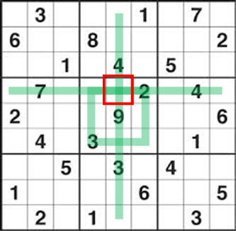
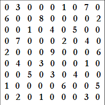
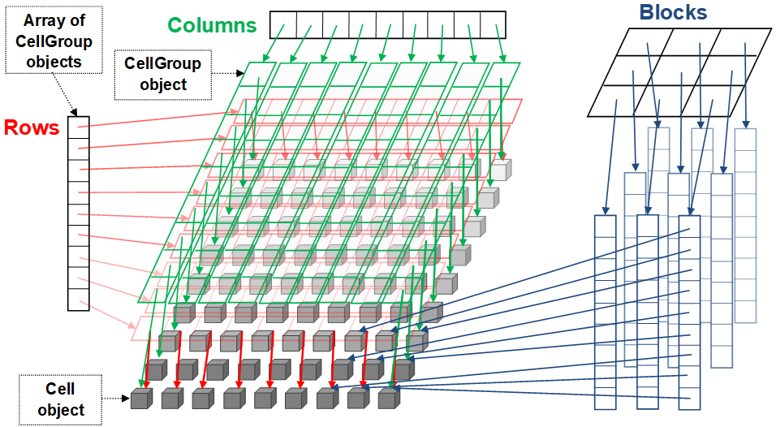

# Advanced Programming - Lab I (Final Lab)

## Investigation of Data Structures for Sudoku Puzzles

Sudoku is a puzzle game were the player calculates the values of cells based on simple rules.  A 9x9 grid is pre-defined with some valid numbers.

This is a simple Sudoku tutorial: <http://www.logicgamesonline.com/sudoku/tutorial.html>

The objective of this lab exercise is to develop one of two alternative data structures to support the solving of Sudoku puzzles, and to investigate their efficiency.

Sudoku is a well-known puzzle based on a 9x9 grid of numbers, in which each digit 1 to 9 must appear once only in each row of the grid, in each column of the grid, and in each 3x3 block of cells.  Initially, only a selection of cells (around 20-30) may be defined by 'given values', with the rest to be determined.
To find out what value should appear in a target 'unknown' cell, all the adjacent cells in the target's row, column and block (the 'triple context') must be inspected to see what values are already present.  This identifies a candidate list of the remaining digits, and the simplest case is that only one candidate value is possible (a 'naked single' value).

`Fig.1 Example Sudoku grid`

Alternatively, a subset of values may be possible, but just one of them is not present in any candidate list of the other unknown cells in the same row (a 'hidden single' value) and so must be selected to appear in the target cell under consideration.  The 'hidden single' might equally be found on the basis of the other unknown cells in the column, or in the block of the target cell.  For example, in Figure 1, the red cell could contain a 1, 5, 6 or 8, but it must contain a '1' since this value cannot appear anywhere else in the row, column or block (the triple context as highlighted by the green lines).  Further logical configurations exist involving for example pairs and triple groups of values, and several cells in pairs of rows and columns, making for more advanced inferences in the puzzle solution process.

For this exercise, the key issue is that the solution process involves frequent exploration of the triple context (row, column and block of cells) surrounding each 'unknown' cell, repeatedly until all the unknowns are solved.  What is the best data structure to support this repeated exploration?  Two alternative structures are proposed for investigation, one that uses a 2D Array of 'Cell' objects, and the other is a system of context index structures.  The first data structure may be easier to understand and implement, however it may not be as efficient as the second data structure.  You are required to develop a C++ program to implement either one of these data structure, and add diagnostic code to report on the behaviour and efficiency of the data structure while cell values are being explored.  More marks are available for the implementation of data structure 2.  

Only one of these data structures will be marked, so only submit one implementation.

## Input and Output

The initial given numbers will be in a data-file format called `sudoku_puzzle.txt` and you are to create code which can populate your data structure by input of the starting given numbers contained in the data-file.  The data-file format consists of 9 lines, each containing 9 integers in the range 0-9 separated by a single white-space, with 0 signifying an unknown value. Figure 2 shows the data-file corresponding to the example grid Figure 1. You may assume that the data-files represent valid Sudoku patterns.

`Fig.2 Example datafile`

After you have completed the process, you must output the final state of the Sudoku grid to a file called `sudoku_solution.txt`, in the exact same format as the `sudoku_puzzle.txt`.  Your output will contain fewer zero numbers than the input, and none if the puzzle has been fully solved.

*Any valid data-file puzzle may be used in the marking of this ACW.  Therefore failure to use the correct data-file format and file names will result in a loss of marks.*

You must implement and submit only ONE of the following data structures

Structure 1 has a maximum implementation mark of 70% and Structure 2 has a maximum implementation mark of 100% (See mark sheet for details).  Therefore it is wise to start the lab exercise early and to start designs for Structure 2 first.  However, Structure 2 does contain some of the implementation required for Structure 1, to some extent.  If Structure 2 is difficult to design and implement then leave yourself plenty of time to complete the implementation of Structure 1.

If you submit both data structures, then only Structure 2 will be marked.

## Structures 1 - A 2D Array of 'Cell' objects

Each Cell should be represented as an object, with fields to hold: an integer as the contained value (once known), a flag to show whether the value was pre-defined in the data-file or has been derived during solving, and a candidate list to show at any point during the solution process what the possible value of the cell could be, while it is still to be decided.  The design of the candidate list is your decision and it could be represented in a number of ways, e.g. as an array or as a std::vector.  The Sudoku puzzle grid is then a 9x9 2D array of cell objects.  Develop code which can populate the grid by input of a starting pattern of predefined values which will be provided as a data-file of 9 lines, each containing 9 integers in the range 0-9, with 0 signifying an unknown value (as described in the Overview).

Develop further code to visit each cell in turn and, for each unknown value, build its candidate list by eliminating from the valid set of digits (1-9), all the values that already appear as predefined values in the 'triple context' of the cell (its row, column and block).

The next step is to consider the candidate list of each cell where the final value is missing in turn and, if possible, identify a value for each cell as a naked single (if the candidate list has only one member value) or as a hidden single (if one member of the candidate list can be shown to not occur in candidate lists elsewhere in any one of the row, column or block of the triple context of the cell under consideration).  A full pass of the Sudoku grid should be made, filling cells with their valid values where possible, and further passes should occur until no cell is solved in a pass.  Each time a cell is solved, the other candidate lists in its triple context should immediately be updated by removing the found value from their candidate lists.

The number of passes through the grid and the number of cells solved by these two simple logic principles will vary depending on the number and pattern of pre-defined values in the initial data.  A number of data-file puzzles will be provided and your software performance should be measured for each of them.  You are required to implement code to determine:

- for each initial data set, how many cells are solved;
- how many passes through the grid are required;
- what is the total number of candidate values considered (e.g. increment a counter every time your code inspects a member of a candidate list in any cell, in any pass).

## Structure 2 - A system of context index structures

Use the same 'Cell' object, as described in Structure 1, as the basis of the puzzle representation.  Additionally, define a 'CellGroup' object as an array of nine pointers to Cell objects.  The puzzle grid may then be defined as an array of nine CellGroup objects, linking to a total of 81 Cell objects, arranged to represent the rows.  Now create two further arrays of nine CellGroup objects, to index the grid as columns and as blocks.

`Fig.3 Example data structure`

Read the data-file puzzle into the nine CellGroup objects that represent the rows. You must then copy pointers from this row index, in the correct selections to represent the columns, and then the blocks.

Develop code to populate the Cells through the row index.  If you have set up your pointers correctly, this should automatically allow you to access the cells in column and block groupings via the other index structures.  You can also test this by writing a simple diagnostic output routine.

Once you have the grid data structures properly set up, proceed to implement the processes described in Structure 1 for solving the Sudoku puzzle using this new approach.  You should be able to create a single method to examine all the candidate lists in a triple context, whether it is a row, a column or a block.  Similar to the specification for Structure 1, add functionality to report the operating statistics and test your software using the example data-file puzzles.

## Parasoft

Your software will be tested against the Parasoft C/C++ static test 500083 ruleset that can be found on the module Canvas site and is described in an earlier lab.  You will also submit a report generated by Parasoft.  Instructions for generating the Parasoft report are on Canvas and will be discussed in lectures.  You will lose marks for each different priority 1, 2 or 3 rule violation.  You will not lose more marks for having the same rule violation more than twice in your code.

## Timing

For your implementation you will display the amount of time to complete the solving of the Sudoku puzzle.  The sample code provides the timing in microseconds. You should take an average time of several executions of your code for the same puzzle.

## Source-Code Skeleton

Initial source code has been provided and MUST be used in your implementation.  The target platform is a PC running Windows 10.  You MUST submit source code that will function properly on any of the PCs in FEN-052.

- Main.cpp - creates an instance of the SudokuPuzzle class (see below) and passes the file name of the puzzle to solve to the `load` method. It then calls the `solve` method to solve the puzzle and finally calls the `output` method to wite the solution to a text file.

- SudokuPuzzle.h and SudokuPuzzle.cpp - contain the base code for your Sudoku solver.  It also contains some timing code and some example code for outputting the solved Sudoku puzzle.

*Note you should not alter main.cpp.*

### Class: SudokuPuzzle

#### Public Methods

`SudokuPuzzle()` - default constructor

`~SudokuPuzzle()` - destructor

`void load(const char filenameIn[])` - This method will read the puzzle and store the data in your data structure.

`void solve ()` - This method will solve the puzzle using your data structure.

`void output(const char filenameOut[]) const`- This method will write your puzzle solution to the text file.

*Note that is it very important that you do not change the interface (i.e. the public methods) for the SudokuPuzzle class, as this will negatively impact your marks.*

## Marking Scheme

A detailed marking scheme has been published on Canvas.

This marking scheme contains a breakdown of all of the marks and will give you the ability to mark yourself as you develop your software and write your lab book.

## Deliverables

### Code

You are to submit all of your code to the module Canvas site.

**BEFORE** you submit your code, make sure that you open your project in Visual Studio and then select `Build -> Clean Solution`

### Parasoft Results

Parasoft C/C++ Static Test results for your source code (in the form of an auto-generated HTML report)

### Lab Book

Create a new chapter (Lab I) in your lab book (maximum 2000 words), which contains:

- A clear statement of which data structure you have submitted.
- A description (with suitable diagrams) of the design of your solution.
- The clock speed of the CPU of the computer that you have used for your performance calculations.
- The results for each puzzle data-file set as a row in a table; columns should indicate:

  - how many cells were solved
  - how many passes through the grid were required
  - what was the total number of candidate values considered
  - the average time in microseconds for the puzzle to be loaded
  - the average time in microseconds for the puzzle to be solved

- A critique of the data structure and its implementation with reference to other relevant data structures.  Describe any adjustments or further improvements you might make to your code to improve its performance and discuss how you might expect the alternative approach, i.e. the indexed structure if you have submitted the array approach, and vice-versa, to perform in relation to the performance you have observed from your submitted implementation.
